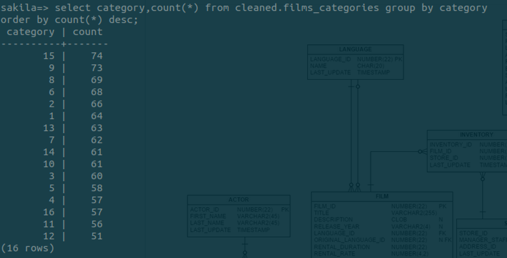
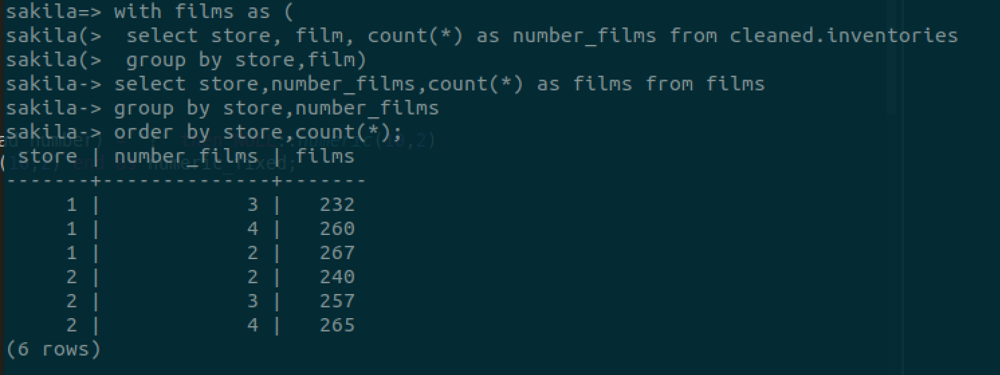
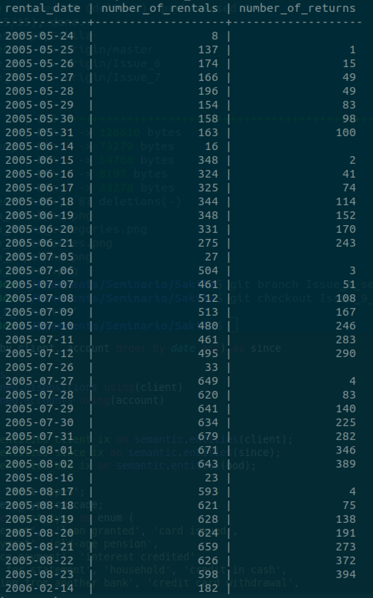
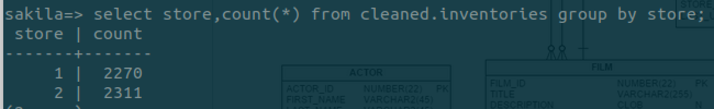

# Sakila

## Fuente de Datos
The [Sakila Database - DVD rental store](https://github.com/jOOQ/jOOQ/tree/master/jOOQ-examples/Sakila)

La base de datos Sakila fue desarrollada originalmente por Mike Hillyer del equipo de documentación de MySQL AB <br/>
Fue convertida a otras bases de datos por DB Software Laboratory <br/>

Licencia: [BSD Copyright DB Software Laboratory](http://www.etl-tools.com)

## Estructura de la Base de Datos

### Actor
- **actor_id** identificador único de cada actor <br/>
- **first_name** nombre del actor <br/>
- **last_name** apellido del actor <br/>
- **last_update** fecha en la que el registro fue creado o la más reciente actualización de dicho registro <br/>

### Address
- **address_id** identificador único de domicilio <br/>
- **address** dirección <br/>
- **address2** columna opcional para dirección adicional o datos adicionales de la dirección. En este caso esta vacía para todos los registros <br/>
- **district** distrito en el que se ubica la dirección. Está vacío para todos los registros <br/>
- **city_id** identificador único de la ciudad en la que se encuentra el domicilio <br/>
- **postal_code** código postal de la dirección en la que se encuentra el domicilio <br/>
- **phone** teléfono del cliente, en este caso está vacío para todos los registros <br/>
- **last_update** fecha en la que el registro fue creado o la más reciente actualización de dicho registro <br/>

### Category
- **category_id** identificador único de las categorías de las películas <br/>
- **name** nombre de las categorías de la películas <br/>
- **last_update** fecha en la que el registro fue creado o la más reciente actualización de dicho registro <br/>

### City
- **city_id** identificador único de la ciudad <br/>
- **city** nombre de la ciudad <br/>
- **country_id** identificador único del país <br/>
- **last_update** fecha en la que el registro fue creado o la más reciente actualización de dicho registro <br/>

### Country
- **country_id** identificador único del país <br/>
- **country** nombre del país <br/>
- **last_update** fecha en la que el registro fue creado o la más reciente actualización de dicho registro <br/>

### Customer
- **customer_id** identificador único de cada cliente <br/>
- **store_id** identificador único de tienda. Sólo se tienen registros de dos tiendas <br/>
- **first_name** nombre del cliente <br/>
- **last_name** apellido del cliente <br/>
- **email** correo electrónico del cliente <br/>
- **address_id** identificador único de cada domicilio del cliente <br/>
- **activebool** en la documentación no hay descripción de esta variable. Se encuentra vacía en todos los registros <br/>
- **create_date** fecha en la que el cliente fue agregado al sistema <br/>
- **last_update** fecha en la que el registro fue creado o la más reciente actualización de dicho registro <br/>
- **active** variable booleana que identifica si un cliente se encuentra activo o no (1: activo y 0: inactivo) <br/>

### Film
- **film_id** identificador único de cada película <br/>
- **title** nombre o título de la película <br/>
- **description** breve descripción de la película <br/>
- **release_year** fecha en la que fue lanzada la película <br/>
- **language_id** identificador del idioma de la película <br/>
- **original_language** idioma original de la película <br/>
- **rental_duration** duración del periodo de la renta medido en días <br/>
- **rental_rate** costo de renta de la peícula en el periodo especificado en la columna rental_duration <br/>
- **length** duración de la película medida en minutos <br/>
- **replacement_cost** monto cargado al cliente si la película no es regresada o si se devuelve dañada <br/>
- **rating** clasificación de la película. Puede ser uno de los siguientes: G, PG, PG-13, R, NC-17 <br/>
- **last_update** fecha en la que el registro fue creado o la más reciente actualización de dicho registro <br/>
- **special_features** lista de las características especiales incluidas en el DVD. Puede ser: ninguna o una o más de las siguientes: Trailers, Commentaries, Deleted Scenes, Behind the Scenes <br/>

### film_actor
- **actor_id** identificador único de cada actor <br/>
- **film_id** identificador único de cada película <br/>
- **last_update** fecha en la que el registro fue creado o la más reciente actualización de dicho registro <br/>

### film_category
- **film_id** identificador único de cada película <br/>
- **category_id** identificador único de las categorías de las películas <br/>
- **last_update** fecha en la que el registro fue creado o la más reciente actualización de dicho registro <br/>

La siguiente imagen muestra el número de películas por categoría: <br/>


### inventory
- **inventory_id** identificador único de inventario de la tienda <br/>
- **film_id** identificador único de cada película <br/>
- **store_id** identificador único de tienda. Sólo se tienen registros de dos tiendas <br/>
- **last_update** fecha en la que el registro fue creado o la más reciente actualización de dicho registro <br/>

La siguiente imagen muestra el inventario por tienda y películas, por ejemplo, la tienda 1 tiene 3 copias de 232 películas: <br/>


### language
- **language_id** identificador del idioma de la película <br/>
- **name** idioma de la película. Solo hay seis idiomas: English. Italian, Japanese, Mandarin, French y German <br/>
- **last_update** fecha en la que el registro fue creado o la más reciente actualización de dicho registro <br/>

### payment
- **payment_id** identificador único de cada pago <br/>
- **costumer_id** identificador único de cada cliente <br/>
- **staff_id** identificador único del miembro del staff que procesó el pago. Sólo tiene 2 valores: 1 y 2 <br/>
- **rental_id** la renta a la que se le aplica el pago. Es opcional porque algunos pagos son por tarifas pendientes y pueden no estar directamente relacionados con la renta <br/>
- **amount** el monto del pago <br/>
- **payment_date** fecha en la que se procesó el pago <br/>

### staff
- **staff_id** identificador único del miembro del staff que procesó el pago. Sólo tiene 2 valores: 1 y 2 <br/>
- **first_name** nombre del miembro del staff <br/>
- **last_name** apellido del miembro del staff <br/>
- **address_id** identificador único de domicilio <br/>
- **email** correo electrónico del miembro del staff <br/>
- **store_id** identificador único de tienda. Sólo se tienen registros de dos tiendas <br/>
- **active** variable booleana que identifica si el empleado se enceuntra activo o no (1: activo y 0: inactivo) <br/>
- **username** nombre de usuario del miembro del staff para acceder al sistema de rentas <br/>
- **password** contraseña usada por el miembro del staff para acceder al sistema de rentas <br/>
- **last_update** fecha en la que el registro fue creado o la más reciente actualización de dicho registro <br/>
- **picture** BLOB que contiene la foto del empleado, en este caso esta vacío para los dos empleados <br/>

### rental
- **rental_id** la renta a la que se le aplica el pago. Es opcional porque algunos pagos son por tarifas pendientes y pueden no estar directamente relacionados con la renta <br/>
- **rental_date** fecha y hora en que se realizó la renta <br/>
- **inventory_id** identificador único de inventario de la tienda <br/>
- **customer_id** identificador único de cada cliente <br/>
- **return_date** fecha en la que se devolvió la película rentada <br/>
- **staff_id** identificador único del miembro del staff que procesó el pago. Sólo tiene 2 valores: 1 y 2 <br/>
- **last_update** fecha en la que el registro fue creado o la más reciente actualización de dicho registro <br/>

La siguiente imagen muestra el número de rentas y de devoluciones por fecha: <br/>


### store
- **store_id** identificador único de tienda. Sólo se tienen registros de dos tiendas <br/>
- **manager_staff_id** identificador único del gerente de la tienda <br/>
- **address_id** identificador único de domicilio <br/>
- **last_update** fecha en la que el registro fue creado o la más reciente actualización de dicho registro <br/>

La siguiente imagen muestra el número total de películas (inventario) para cada tienda: <br/>


## Diagrama de Entidad Relación


## Pipeline


## Instalación y Ejecución

- Primeros pasos
Clonar repositorio de github en máquina virtual de vagrant <br/>
```shell
git clone https://github.com/Jasselpf/Sakila
```
Ubicarse en la carpeta Sakila clonada <br/>
Ejecutar el archivo *set_up.sh* <br/>
```shell
./set_up.sh
```
Este archivo ejecutará los siguientes pasos: <br/>

Crear entorno virtual sakila con python 3.7.3 <br/>
```shell
pyenv virtualenv 3.7.3 sakila
```
Apuntar a carpeta para activar el ambiente virtual <br/>
```shell
echo 'sakila' > .python-version
```
Instalar poetry <br/>
```shell
pip install poetry
poetry install
```
Crear usuario sakila <br/>
```shell
sudo su postgres
createuser sakila -D -l -P
createdb -O sakila sakila
```
- Crear esquemas <br/>
Se crean los esquemas a utilizar que son: raw, cleaned y semantic <br/>
```python
cd sakila
python sakila.py create-schemas
```
- Crear raw tables <br/>
Se crean los esquemas de las tablas tal como estaban de origen y poniendo todos los campos como tipo texto. Se cargan los datos <br/>
```python
python sakila.py create-raw-tables
python sakila.py load-sakila
```
Para revisar que se hayan creado las tablas en el esquema raw <br/>
```shell
\c sakila
SET search_path TO raw; 
\dt
```
- Crear tablas limpias <br/>
Se siguen las mejores prácticas vistas: se renombran las tablas y los campos, se asigna el tipo de dato correcto, los textos se pasan a minúsculas <br/>
```python
python sakila.py to-cleaned
```
- Crear tablas semantic <br/>
```python
python sakila.py to-semantic
```

Nos planteamos responder las siguientes preguntas: <br/>
1. ¿Cuántas rentas va a hacer el cliente? <br/>
2. Predecir el monto de renta por cliente en un periodo <br/>

Por tal motivo decidimos que nuestra **entidad** sería el *cliente* y los **eventos** que definimos relacionados a este son: <br/>
1. Rentar película <br/>
2. Devolver película <br/>


